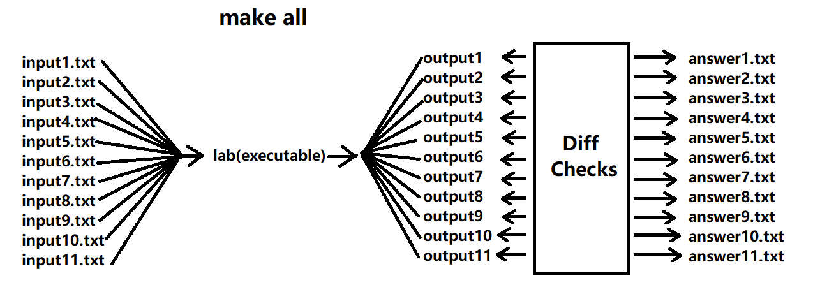
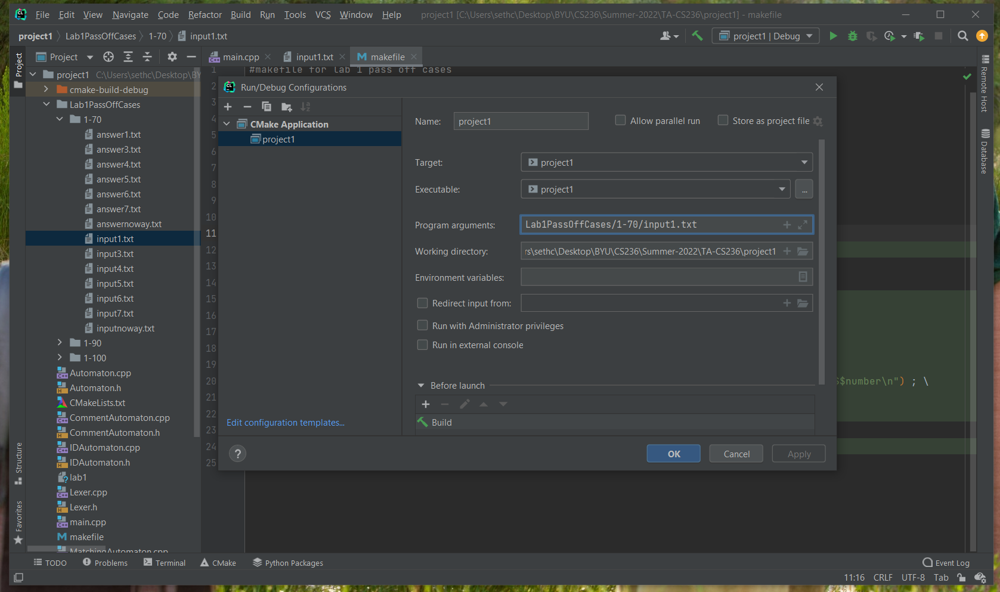
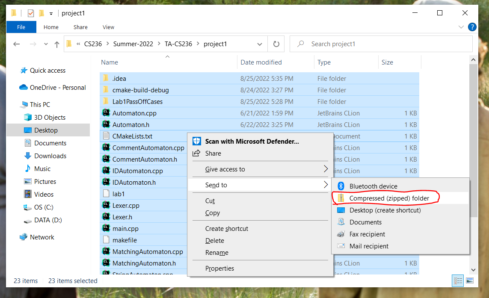

# How to Use a makefile Tutorial

### Estimated Time for Completion: 10 minutes

## Introduction
Welcome to the How to Use a makefile Tutorial! As you already know, in this class we have 5 main projects that will be done over the course of the semester. After completing each step of a project, you'll obviously want to know if you are really done or if there are bugs to be fixed! Because your project's output needs to be entirely correct, we actually give you the passoff files. This will help you to check to make sure your project's output exactly matches the answer file for each input case.

It sounds nice but checking to make sure your output matches exactly is a real pain! Because it's too tedious, we've given you a makefile for each project, which is simply a file which holds a list of scripts you can run in your terminal. Each makefile we give you will have a script inside which will do all of the output to answer file checking for you. Learning how to use a makefile will make your life in this class much easier, so good luck!

## Tutorial: How to use a makefile
 

1. Find the makefile and project pass-off cases downloads for a specific project on Learning Suite and download them. You must rename the makefile is named exactly 'makefile', no caps, so difference at all. It won't work at all otherwise

2. Extract the zipped projectpassoffcases folder and make sure the cases folders are directly inside

3. Place both the makefile and the projectpassoffcases folder inside the main directory of your project

4. Make sure you've installed the 'g++' and 'make' commands in your Linux commpatible terminal. If they aren't, run 'sudo apt install g++' and 'sudo apt install make' in your terminal. If it doesn't work try running 'sudo apt update' and trying again.

5. Look inside the makefile, you should see 3 scripts, one called 'all', another called, '($buckets)', and the last one called 'compile'

6. Notice what the compile script says, it uses the g++ compilation command likely familiar from CS 235. It's not very easy to remember the whole thing, which is why you don't have to. That's why we give you the simple 'compile' script which will run it for you.

7. Once you think you've finished all the steps of the project, use the compilation script to compile your code into an executable that can be run. Do this by running this command in your Linux compatible terminal: 'make compile'. The command 'make' accesses the makefile and then you just type the name of the script you want to run.

8. Now you should see an executable file show up in your current directory, the .exe is hidden.

9. If my executable is called lab1, then back in CS 235 I might run it by running the command: './lab1 inputfile.txt'. But we don't want to run one input file at a time, we want to run them all. Notice the 'all' script in the makefile uses the '($buckets)' script to loop through each input file, then runs each input through your executable, taking the output and comparing it to the corresponding answer file.

10. Run that script by typing into the terminal: 'make all'. If there are no mistakes you will see it run through each input with no problem, otherwise it will print out the difference and say that the diff check failed on that test

11. If any tests failed, take the first failed input and run that input through your code in CLion, this way you can debug and find out why your code didn't match the answer file when running that input file

12. After making any changes to your code, recompile with 'make compile' and then rerun the tests with 'make all', repeat steps 11 and 12 until all tests run smoothly with no failures

13. Once there are no failures, your project should be complete! Zip up each file in your project directory (not the project folder) and submit on the passoff site (or with a TA) for passoff!

## Complete