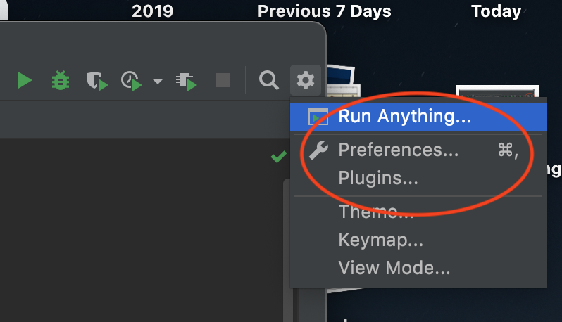
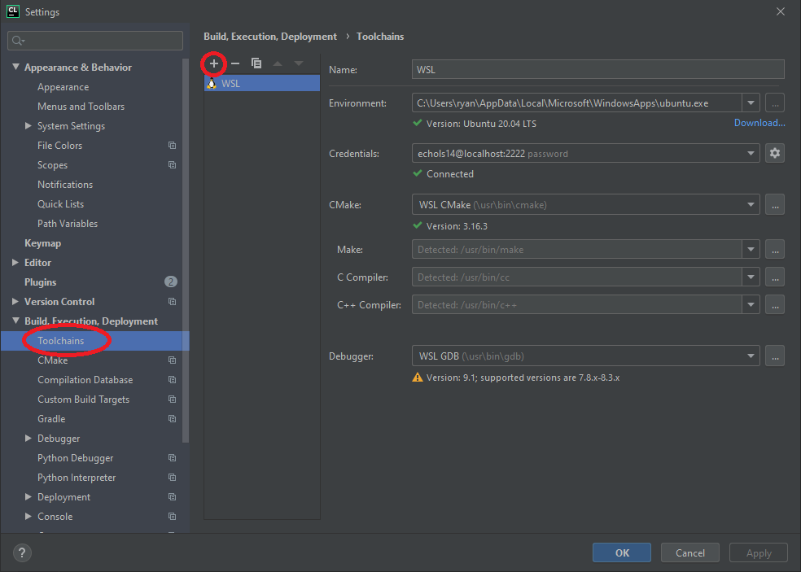
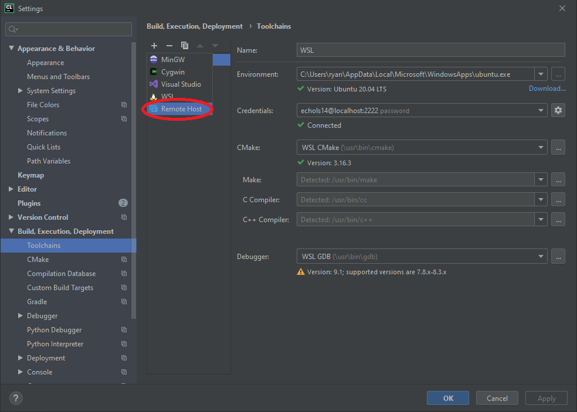
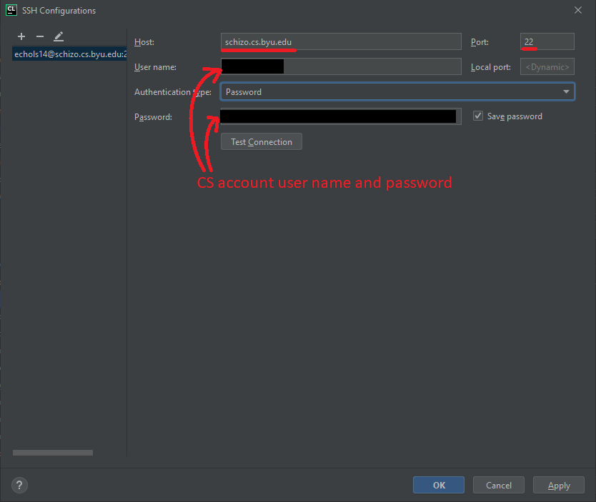
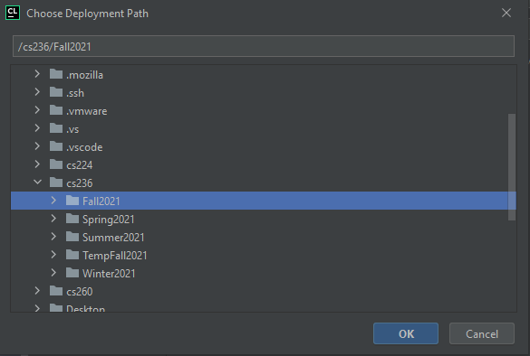
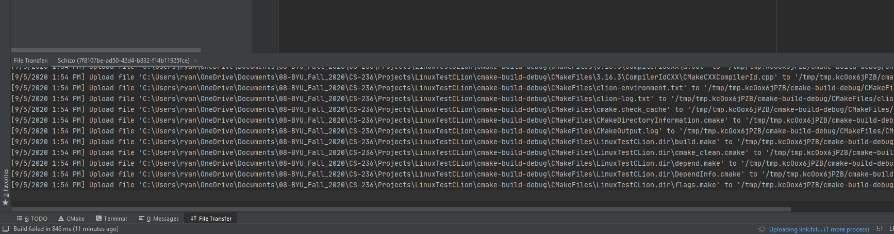
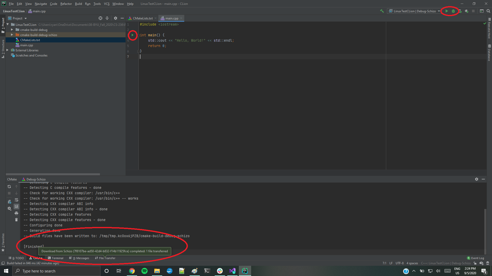
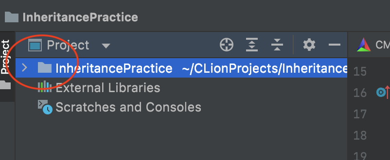
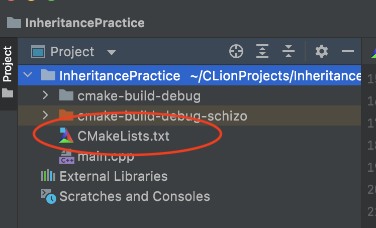
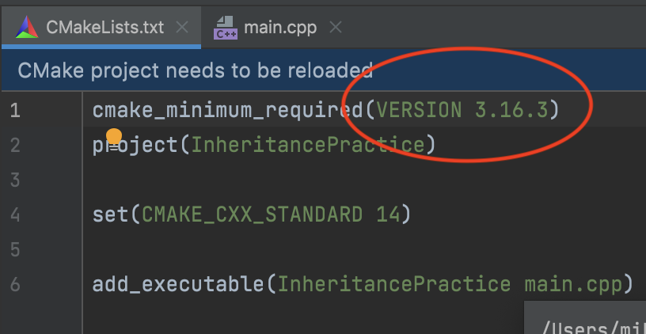

# Lab0
---
### Part 0: TA Recommendations
We advise students to use CLion. The reason for this is that is has good debugging tools and the TAs are familiar with it. You may choose to use a different IDE if you wish but be warned that the TAs won't be able to help with IDE specific issues as effectively. If you are making this choice submit a screenshot of the hello-world program (the one you should be familiar with, shown in Part 3) running in your IDE/programming environment and you will receive full credit for this lab!

---
### Part 1: Installing Clion
---
##### Part 1a: License Creation
If you already own clion you may skip this step. If not you may get a free educational license by following the steps below:
1) Go to the following link [https://www.jetbrains.com/community/education/#students](https://www.jetbrains.com/community/education/#students)
2) Click apply now
3) On the form fill out your information as stated. Make sure to use your byu outlook account which is your netID@byu.edu
4) Log onto your email on the following page: [http://outlook.byu.edu/](http://outlook.byu.edu/)
5) Click the activation email then from there it will ask you to login/create a jet-brains account
6)  Download clion from this page
---
##### Part 1b: Download
1) Download clion from the following link if not already installed: [https://www.jetbrains.com/clion/download/](https://www.jetbrains.com/clion/download/)

---
### Part 2: Setting up clion project
Before completing these instructions on how to connect CLion to the CS lab machines, make sure that you have a CS account set up and that you remember your password. If you do not, follow the appropriate instructions [here](https://docs.cs.byu.edu/doku.php?id=setting-up-your-account-with-the-cs-authentication-system).

It is best to have a simple main.cpp file open in CLion before you begin these steps.

1.  Open your project in CLion.
2.  Open the settings menu.


3.  Choose "Preferences" or "Settings" from settings menu




4.  Open the "Toolchains" sub-menu, and click the + to add a toolchain.  A "toolchain is a set of all the necessary tools required for building and running your application: the working environment, the CMake executable, the make tool and compliers, and the debugger." [See this CLion help page](https://www.jetbrains.com/help/clion/how-to-create-toolchain-in-clion.html). 



5.  Select "Remote Host"



6.  In "Name" enter something you'll recognize. I put "Schizo" because this is the name of the "macro" in the open labs that assigns you to a specific remote computer when you do remote access. 
7.  Click the gear icon to add new remote credentials and hit "+" if necessary to create a new ssh configuration.


8.  For host enter schizo.cs.byu.edu and for port enter 22
9.  For user name and password, use your CS account credentials. Issues with you CS account can be resolved [here](https://docs.cs.byu.edu/doku.php?id=setting-up-your-account-with-the-cs-authentication-system)
10.  Click "Test Connection" to make sure it's connecting to the lab machines (you may need to be using the [CS VPN](https://docs.cs.byu.edu/doku.php?id=VPN-Configuration-and-Use) if you're not on campus).


11.  After clicking ok, you should see all fields filled in, and only green checks. You may have to wait a moment.


12.  Open the CMake sub-menu, and for Toolchain select the toolchain you just created. Find the field that says "Toolchain", click the down arrow, and select the name of the toolchain that you just created. "CMake is a meta build system [in CLion] that uses scripts called **CMakeLists** to generate build files for a specific environment (for example, make files on [the] Unix machines [in the lab]). When you create a new CMake project in CLion, a **CMakeLists.txt** file is automatically generated under the project root." [From CLion help pages](https://www.jetbrains.com/help/clion/quick-cmake-tutorial.html).

13.  Go down to the deployment menu


14.  Click on the Remote Host Profile and set the Root Path. (Mike G. had to close the settings and reopen them to see the option for choosing the remote host. If you can't see the option, click ok and then reopen the settings-->preferences.) This must take you to the home directory of your account on the CS Department Lab Machines. The Auto Detect Button should work but if not the path is  _user/guest/[first letter of netID]/[netID]_


15.  Click on the Mappings Tab and Verify that your Local Path takes you to the location that your project is stored on your _Local Machine_. Then adjust the deployment path, which is where your project is stored on the _Remote Host_. The deployment path MUST point to an empty folder on the Remote Host. You can add a new folder by right-clicking and selecting the new->Directory. (Mike G couldn't get the right-clicking to work from his Mac, but he was able to just type in a path.) Highlight the location of an empty blue folder by clicking on it. Then hit OK. This is where your code will be stored on the lab machines. Clion will copy it from your _local machine_ to the _remote host_ on the department lab computers whenever you build.





16.  Once you click OK to save changes to your settings, you should see messages about uploads and such (CLion is getting things set up on the lab machine). You may need to wait a few minutes for this to finish.



17.  When the syncing is finished, you should see messages saying so, and be able to run your code using the green play buttons or the debug button. If you don't see a green play button next to the main method of your program, you might have one of the problems listed in the section below.

---

**Useful Tips, plus Common Problems and their solutions**

1.  "_CMake 3.17 or higher is required._" Once you have completed this tutorial, you may get an error that looks like this:


  

To resolve this error, navigate to the CMakeLists.txt file by clicking on the down arrow next to the name of your project.



Click on the link to open the file.


On the first line of the file, change the required version to be the same as the version you are running.  Save the file.


**Before** making the change.


**After** making the change. 



You might need to click "reload changes" before you'll see the green arrow next to main.


`TODO: Take a screenshot of the hello-world program running! (name your file "s1" for screenshot 1 so it is easier for the TAs to grade)`

Grading note: We advise students to use CLion. The reason for this is that is has good debugging tools and the TAs are familiar with it. You may choose to use a different IDE if you wish but be warned that the TAs won't be able to help with IDE specific issues as effectively. If you are making this choice submit a screenshot of the hello-world program running in your IDE/programming environment and you will receive full credit for this lab!

---
### Part 3: Hello World Program
```c++
#include <iostream>  
  
int main() {  
    std::cout << "Hello, World!" << std::endl;  
    return 0;  
}
```
---
### Conclusion
1. Submit your screenshots in a .zip folder on learning suite
2. Leave any feedback in notes of your lab submission.
