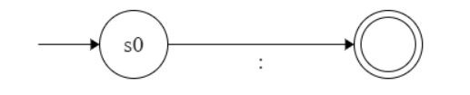

# Lab1
 # Lab1
---
### Part 0: Walter's Best Practice
1. This is advice, please take it as such
2. Stay organized
3. Keep consistent style as there are no style requirements in this course it is up to you to enforce that for yourself
4. Make friends and talk to them about the class
5. Read through and fully understand the provided code. If you have questions please ask a TA!
6. For smaller files try to keep your code in only the header files (.h) instead of splitting them between a .h and .cpp
7. Please only use unsigned ints or size_t in this course. None of the labs require negative numbers and this will improve consistency.
8. Write a toString for every class (Except maybe the automaton classes). This will be helpful during testing and debugging.
---
### Part 1: Tokens
1. Make a `TokenType` enum (`Token.h`). You will need to add more to this list later but 
```c++
enum TokenType {
  COMMA, COLON, COLON_DASH, UNDEFINED, ...
};
```

2. Make a `Token` class (`Token.h`). A token is comprised of 3 things (Type, Contents, LineNum)
```c++
class Token {
 private:
  TokenType type;
  String contents;
  unsigned int line;
};
```

3. Create a constructor (`Token.h`)
`TODO: Write the constructor yourself. Take a screenshot of the constructor you wrote and turn it in (s1)`
Feel free to use your IDE to generate it. Your constructor should initialize the "type", "contents", and "line" variables using its arguments.

4. Write "toString" function for the "Token" class
~~~c++
  string toString() const {
    stringstream out;
    out << "(" << type << "," << "\"" << contents << "\"" << "," << line << ")";
    return out.str();
  }
~~~

5. Create and print a `Token` in the `main` function (main.cpp) with the following values
type=COMMA
value=","
line=42
`TODO: Take a screenshot of the code you wrote to test this and the resulted print (s2)`

6. Notice how the output has a number in place of the COMMA enum-type. We need to fix this. Add the following function to Token.h. You will need to call this function in `Token::toString()` 
```c++
string typeName(TokenType type) const {
  switch (type) {
  case COMMA:
    return "COMMA";
  ...
  }
}
```
`TODO: Add cases for COLON and COLON_DASH types, take a screenshot (s3)`

---
### Part 2: Automaton Base Class
1. Here we will create an Automaton.h file. This will be the base class for all of our Automata. Later we will show you how to use this.

```c++
#include <string>
#include "Token.h"

class Automaton {
protected:
	
    // This tracks where in the input we are
    unsigned int currCharIndex = 0;
	
    // This tracks the number of newLines we have read
    unsigned int newLinesRead = 0;

	TokenType type = TokenType::UNDEFINED;
	// This tracks the total number of characters consumbed
	// This is different from currCharIndex to let you "peek" at the next input without consiming it
    unsigned int numCharRead = 0;
    std::string input = "";

    // All children of this class must define this function
    virtual void s0() = 0;

    // Helper functions
    void next() {
        if (curr() == '\n')
            newLinesRead++;
        numCharRead++;
        currCharIndex++;
    }

    char curr() {
        return input.at(currCharIndex);
    }

    bool match(char c) {
        return (curr() == c);
    }

    // Call this function to check if you have reached the end of file
    bool endOfFile() {
        return (currCharIndex >= input.size());
    }

    // This is the error state call it when the token is invalid
    void sError() {
        numCharRead = 0;
    }

public:
    Automaton() {}

    unsigned int run(std::string input) {
        this->input = input;
        currCharIndex = 0;
        newLinesRead = 0;
        numCharRead = 0;
        s0();
        return numCharRead;
    }

    unsigned int getNewLines() {
        return newLinesRead;
    }

	TokenType getType() {
		return type;
	}
};
```

---
### Part 3: Lexer
1. Create a Lexer.h file.
```c++
#include <string>
#include "Token.h"
#include "Automaton.h"

class Lexer {


}
```

2. Add 2 private members
```c++
vector<Automanon*> automata
vector<Token> tokens
```

3. Write a getter for the "tokens" member
4. You will need to following methods:
```c++
void initializeAutomata() {
	// Here you will create and add each automaton to your automata vector
}
vector<Token> run(string input) {
	initializeAutomata()
	// TODO:: write the parralel and max logic
	return tokens;
}

```

---
### Part 4: Parallel and Max
The next big step here now that we have the architecture created is to implement our algorithm. I want to take a moment to justify that algorithm.

We are trying to define the syntax for a programming language. We have a list of desired patterns. Here is a partial list of them:

| Type       | Symbol     | Example        | Description                                                                                                                  |
| ---------- | ---------- | -------------- | ---------------------------------------------------------------------------------------------------------------------------- |
| Colon      | COLON      | :              | The character ':'                                                                                                            |
| Colon dash | COLON_DASH | :-             | The string ":-"                                                                                                              |
| Identifier | ID         | See table below | An identifier is a letter followed by zero or more letters or digits.| 

ID Example:

| Valid | Invalid |
| ----- | ------- |
| myID  | 1myId   |
| onePerson | onePers@n |

So if your input string is "::-onePerson"

By those rules it should become the following tokens:
```c++
(COLON, ":", 1),
(COLON_DASH, ":-", 1),
(ID, "onePerson", 1)
```

Parallel and Max Algorithm (this goes in the run method of Lexer.h):
1) Initialize Max Variables
```c++
Automaton* maxAutomaton = automata.at(0) 
unsigned int maxRead = 0
```
2) Handle whitespace and count newlines (not required for the lab, but will be required for the project leave a TODO comment in your code for you to come back to so you know where to put this logic)
3) Iterate through each automaton
```c++
for (unsigned int i = 0; i < automata.size(); i++) {
	Automaton* currentAutomaton = automata.at(i);
}
```
4) In our loop call `currentAutomaton`'s run method. If the result of that call is larger than `maxRead` update `maxRead` and `maxAutomaton` to be the new values of those variables. This is the "Max" part of the algorithm because we find the maximum value of that variable. 
`TODO: Write the code described in this step and take a screenshot (s4).`
Hint 1: `currentAutomaton.run()` takes a string and returns an int. The string represents the input you want to validate, the int is how many characters the Automaton read (0 represents a failure). 
Hint 2: When if maxRead and currentAutomaton.run() are the same *do not* update maxRead and maxAutomaton

 5) Create a token and delete the read section from the input.
```c++
Token currToken = Token(maxAutomaton.getType(), input.substring(0, maxRead), 0/*the line number is being set to 0, which is fine for the lab but you will need to fix this for the full project*/);
cout << currToken.toString() << endl;
input = input.substring(maxRead);
tokens.push_back(currToken);
```

 6) Wrap the code written for steps 1-5 code in a while loop. Your condition should check to see if `input.size() > 0`. This will repeat steps 1-5 until it has consumed the entire input string.
 7) After the while loop returns tokens to close off the function.

---
### Part 5: Create Automata
1) Colon Automaton

As a reminder it looks like the following:


Here is how that turns into code:
Create ColonAutomaton.h
```c++
#include "Automaton.h"
class ColonAutomaton : public Automaton {
private:
	ColonAutomaton() {
		type = TokenType::COLON; // set the type
	}
	void s0() {
		if (match(':')) {
			next();
			return; // this represents accepting the input
		}
		else
			sError(); // this calls the error state
	}
}
```

2) Colon_Dash Automaton
As a reminder it looks like the following:


and the code:
Create ColonDashAutomaton.h
```c++
#include "Automaton.h"
class ColonDashAutomaton : public Automaton {
private:
	ColonDashAutomaton() {
		type = TokenType::COLON_DASH; // set the type
	}
	void s0() {
		if (match(':')) {
			next();
			s1(); // call s1 as the transition
		}
		else
			sError(); // this calls the error state
	}
	void s1() {
		if (match(':')) {
			next();
			return; // this represents accepting the input
		}
		else
			sError(); // this calls the error state
	}
}
```

every state has a function, and each transition is a case on the if/else chain (remember that every diagram implicitly has a fail transition if none of the others pass)

3) Undefined Character Automaton

Create the UndefinedCharAutomaton.h
```c++
#include "Automaton.h"
class UndefinedCharAutomaton : public Automaton {
private:
	UndefinedCharAutomaton() {
		type = TokenType::COLON_DASH; // set the type
	}
	void s0() {
		next(); // read next character
		return; // accept the input
	}
}
```

4) Identifier Automaton
Code:
Create IDAutomaton.h
```c++
#include "Automaton.h"
// need these for isalnum and isalpha
#include <stdio.h> 
#include <ctype.h>
class IDAutomaton : public Automaton {
private:
	UndefinedCharAutomaton() {
		type = TokenType::COLON_DASH; // set the type
	}
	void s0() {
		if (isalpha(curr())) {
			next();
			s1();
		}
		else 
			sError();
	}
	void s1() {
		if (isalnum(curr())) {
			next();
			s1();
		}
		else
			return; //accept
	}
}
```

`TODO: draw the FSA based on the following code. Take a screenshot or picture (s5)`
Hint 1: There is a self loop. 
Hint 2: It may be helpful to include sError in your diagram but you are not required to do so. If you do write "error" as the state name to denote it. An error state has no outgoing transitions. 
Hint 3: The following site may be helpful: [Finite State Machine Designer](https://www.madebyevan.com/fsm/)

### Part 6: Add Automata to Lexer
1) add the following includes to `Lexer.h`
```c++
#include "IDAutomaton.h"
#include "ColonAutomaton.h"
#include "ColonDashAutomaton.h"
#include "UndefinedCharAutomaton.h"
```

2) in the Lexer's initilizeAutomata method `Lexer::initilizeAutomata()` add the following code:
```c++
void initializeAutomata() {
	automata.push_back(new ColonAutomaton());
	automata.push_back(new ColonDashAutomaton());
	automata.push_back(new IDAutomaton());
	automata.push_back(new UndefinedCharAutomaton());
}
```
The order you choose to write these matters. This is your tie breaker. If an Automaton is earlier in the list it will have higher precedence when both return the same value.

---
### Part 7: Test
Run the following code in main:
```c++
#include "Lexer.h"
int main() {

	Lexer lexer;
	lexer.run("::-onePerson");
	return 0;
}
```

It should produce the following as output:
```
(COLON, ":", 0)
(COLON_DASH, ":-", 0)
(ID, "onePerson", 0)
```

---
### Conclusion
1. Submit your screenshots in a .zip folder on learning suite
2. Leave any feedback in notes of your lab submission.

---
### TODO for the project 
##### (NOT REQUIRED FOR THE LAB)
1. Write and test all of the Automata on the lab specs
	1. Start with the easy ones
	2. Test as you go
	3. Draw the automaton before writing code
	4. When you have problems make sure your drawing matches your code and that your automaton drawing is correct
2. Write separate Automata for SingleLineComment, BlockComment, UndefinedBlockComment, String and UndefinedString tokens.
3. Add newline tracking
4. Read in input from a file whose name is passed in from a command line argument and print output to the standard output (cout)
5. Good Luck!
